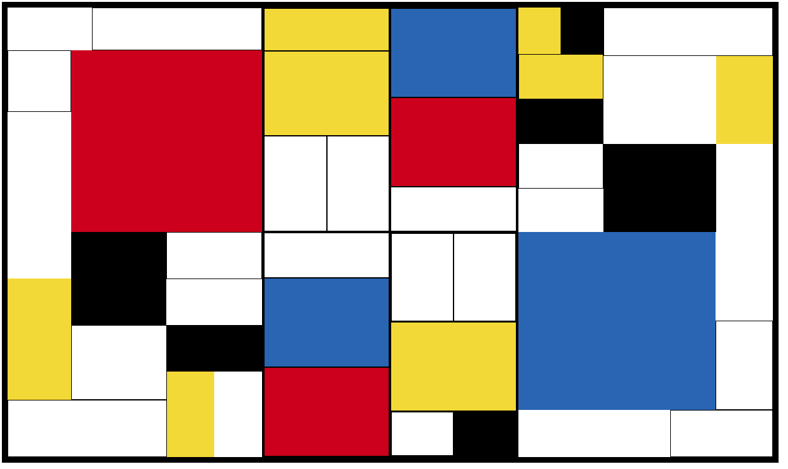

# Mondrian ALL CSS

This was an exercise to get familair with flexbox 

# Final result
This is unfinished, I was about 90% there. Had a few more boxes to fill in and then some border adjusting.. which I am sure would have been more work than that sounds. Class was moving forward and I received the practice and understanding intended from the exercise.

